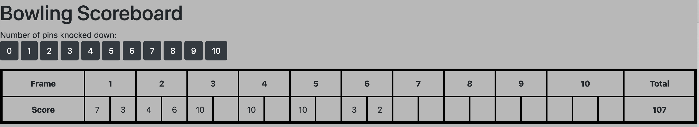

Bowling Challenge
=================

Forked from [here](https://github.com/makersacademy/bowling-challenge). 
Deployed [here](https://andrewhulme.github.io/bowling-challenge/).

## Description
A dynamic bowling scorecard based on the classic coding kata.

## Approach
I have split the logic into two classes: Game and Frame. 

- The Game class is responsible for storing the frame scores, adding frames and calculating the scores. 
- The Frame class is responsible for calculating if a frame is a strike or a spare. 

There is also a jQuery interface file which is responsible for all interactivity.

## Technology used
- Languages/Technologies: JavaScript, jQuery, HTML/CSS, Bootstrap
- Testing Framework: Jasmine

## How to run the project:
- Clone this repository from Github then open the index.html file in your browser.
- Click on the buttons to input your score.
- See your current/final score!

An example of code running can be seen below:

## How to run tests:
Clone this repository from Github then open SpecRunner.html in your browser.

